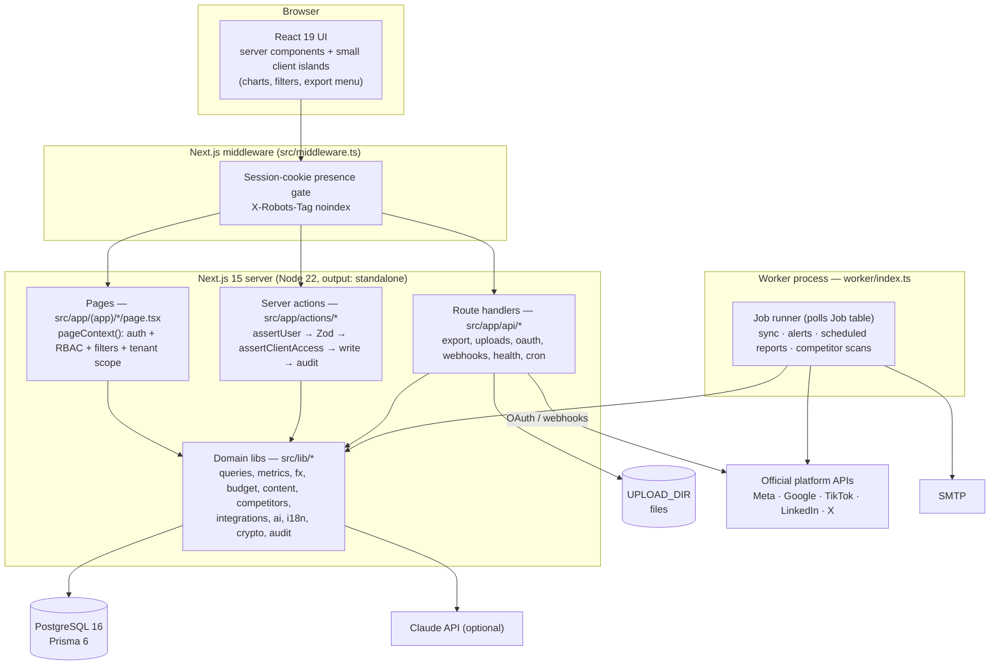
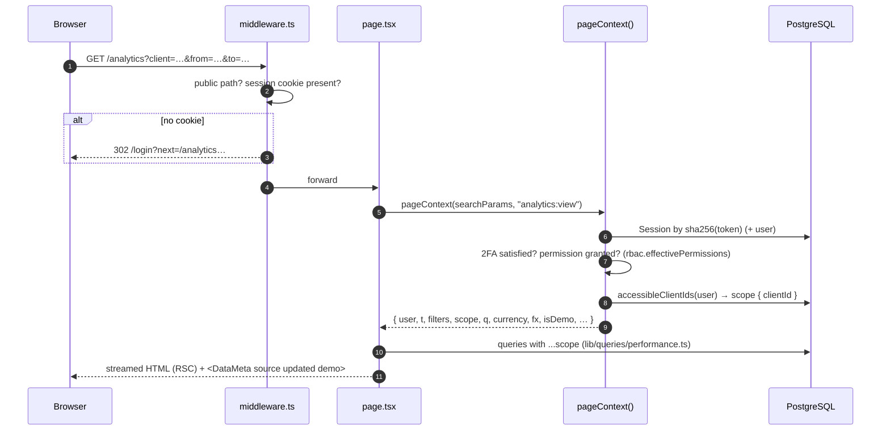
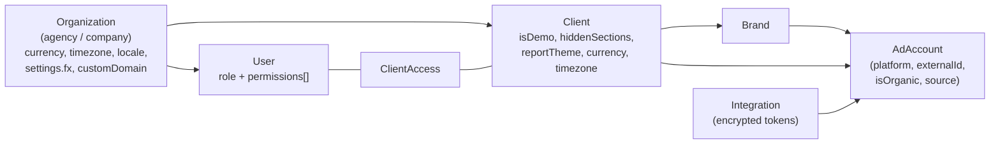
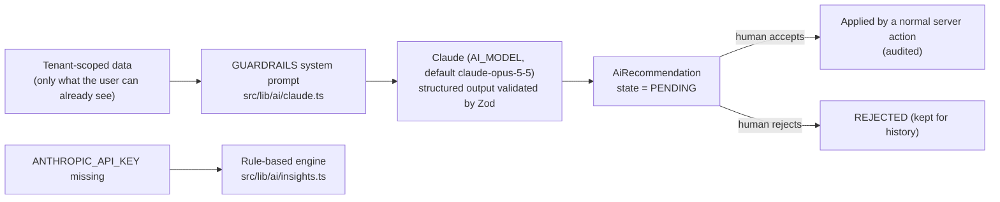

# 01 · Product Architecture

> **ملخص بالعربية**
>
> المنصة لوحة تحكم متعددة العملاء والعلامات التجارية لوكالات التسويق، تعمل بالعربية (من اليمين لليسار) والإنجليزية. مبنية على Next.js 15 (App Router) وReact 19 وTypeScript وPostgreSQL عبر Prisma، مع طابور مهام خلفية داخل قاعدة البيانات نفسها (لا حاجة لـ Redis) وعامل خلفي (worker) منفصل.
>
> - **التسلسل الهرمي للبيانات:** المؤسسة (الوكالة) ← العميل ← العلامة التجارية ← الحساب الإعلاني. كل استعلام مقيَّد بعملاء المستخدم المسموح بهم (`src/lib/tenant.ts`).
> - **الأمان:** جلسات بكوكي آمن، مصادقة ثنائية، صلاحيات دقيقة لكل دور (`src/lib/rbac.ts`)، تشفير رموز المنصات بـ AES-256-GCM، وسجل تدقيق لكل عملية.
> - **الأمانة في البيانات:** كل رقم يحمل مصدره: API أو إدخال يدوي أو استيراد أو تقدير أو بيانات تجريبية، ويظهر ذلك بوضوح في الواجهة.
> - **الذكاء الاصطناعي:** اختياري (Claude). لا يرى إلا بيانات العميل المسموح بها، لا يخترع أرقامًا، ولا يطبّق أي شيء تلقائيًا — كل اقتراح ينتظر موافقة بشرية.
> - **المهام الخلفية:** مزامنة المنصات والتنبيهات والتقارير المجدولة عبر جدول `Job`؛ وعلى الاستضافة المشتركة تُشغَّل عبر `/api/cron` بدل الـ worker.

---

## 1. Goals and non-goals

| Goals | Non-goals |
|---|---|
| One place for an agency to plan, run, approve and report marketing for many clients and brands. | Replacing ad managers — the platform reads and plans; it does not edit live campaigns. |
| Bilingual (Arabic RTL / English LTR) with identical feature parity. | Scraping any platform. Only official APIs, official ad libraries, imports and manual entry. |
| Honest data: every number shows its source, freshness and whether it is an estimate or demo. | Inventing competitor spend, search volumes or benchmarks. |
| Deployable on commodity hosting (Hostinger VPS) without Redis/Kafka/Kubernetes. | Multi-region active/active (see §10 for the scale path). |

## 2. Layers



| Layer | Location | Responsibility |
|---|---|---|
| Edge gate | `src/middleware.ts` | Redirects to `/login` when no `mimd_session` cookie on non-public paths; sets `X-Robots-Tag: noindex` on everything except `/login` and `/legal`. It does **not** validate sessions (cheap check only). |
| Page bootstrap | `src/lib/page.ts` `pageContext()` | Resolves the user (`requireUser`), checks the page permission, parses URL filters (`src/lib/filters.ts`), computes tenant scope, reporting currency and FX, demo flag. |
| Auth | `src/lib/auth/session.ts`, `password.ts`, `totp.ts` | DB-backed sessions (hashed token), bcrypt(12) passwords, TOTP 2FA. |
| Authorization | `src/lib/rbac.ts` | Permission catalogue, role defaults, per-user overrides, hard guards. |
| Tenancy | `src/lib/tenant.ts` | `accessibleClientIds`, `clientWhere`, `assertClientAccess`. |
| Data access | `src/lib/db.ts`, `src/lib/queries/*` | Prisma client; performance aggregation with currency conversion (`src/lib/fx.ts`). |
| Domain logic | `src/lib/metrics.ts`, `src/lib/budget/*`, `src/lib/content/*`, `src/lib/competitors/*` | KPIs, forecasting, allocation, workflow, best-time, intensity index. |
| Integrations | `src/lib/integrations/*` | Connector interface + providers, OAuth, token vault, sync pipeline (see [05](05-integration-architecture.md)). |
| AI | `src/lib/ai/claude.ts`, `src/lib/ai/insights.ts` | Guarded Claude calls; deterministic rule-based fallback. |
| Cross-cutting | `src/lib/audit.ts`, `logger.ts`, `sanitize.ts`, `rate-limit.ts`, `http.ts`, `mailer.ts`, `crypto.ts` | Audit trail, JSON logs with redaction, limiter, route errors & same-origin checks, SMTP, AES-GCM. |
| i18n | `src/lib/i18n/*` | `en` + `ar` message namespaces, `dir` switching, locale cookie. |
| UI kit | `src/components/ui/*`, `src/components/charts/charts.tsx`, `src/components/layout/*` | Primitives, KPI card, data table, export menu, charts, app shell, sidebar, filter bar. |
| Background | `worker/index.ts`, `Job` table | Polling job runner (see §8). |

## 3. Modules

| Module | Routes | Key models | Owner lib |
|---|---|---|---|
| Executive dashboard | `/dashboard` | `MetricDaily`, `BudgetPlan`, `Benchmark` | `lib/queries/performance.ts`, `lib/ai/insights.ts` |
| Performance analytics & campaigns | `/analytics`, `/campaigns` | `Campaign`, `AdSet`, `Ad`, `MetricDaily`, `OrganicMetricDaily` | `lib/queries/*` |
| Clients & brands | `/clients`, `/clients/[id]`, `/onboarding` | `Client`, `Brand`, `AdAccount`, `ClientAccess` | `app/actions/clients.ts` |
| Strategy builder | `/strategy` | `Strategy`, `AiRecommendation` | — |
| Budget planner / plan vs actual | `/budget`, `/plan-vs-actual` | `BudgetPlan`, `BudgetLine`, `Expense` | `lib/budget/*` |
| Content calendar, library, approvals | `/calendar`, `/library`, `/approvals` | `ContentItem`, `ContentVersion`, `Comment`, `Approval`, `FileAsset` | `lib/content/*` |
| Competitor intelligence | `/competitors` | `Competitor`, `CompetitorAd`, `CompetitorPost` | `lib/competitors/*` |
| Trends & ideas | `/trends` | `TrendSignal`, `Idea` | — |
| Benchmarks | `/benchmarks` | `Benchmark` | `lib/queries/benchmarks.ts` |
| Reports | `/reports`, public `/r/[token]` | `Report` | — |
| Tasks | `/tasks` | `Task` | — |
| Notifications & alerts | `/notifications` | `Notification`, `NotificationPreference` | worker `alerts.evaluate` |
| Users, settings, integrations, audit | `/users`, `/settings`, `/settings/integrations`, `/audit` | `User`, `Invitation`, `Organization`, `Integration`, `SyncRun`, `AuditLog` | `lib/integrations/*` |
| Help & legal | `/help`, `/legal/*` | — | — |

## 4. Request flow

### 4.1 Page render (server component)



### 4.2 Mutation (server action)

```
assertUser("content:edit")          → 401/403 AuthError if not allowed
schema.parse(input)                  → Zod validation of every field
assertClientAccess(user, clientId)   → NOT_FOUND if outside tenant scope
db.<model>.update(...)               → always scoped by id AND clientId
audit(user, { action, entity, entityId, clientId, diff })   → sanitized diff
revalidatePath("/route")
```

Server actions are CSRF-protected by Next.js (Origin/Host check). Route handlers that mutate call `assertSameOrigin(req)` from `src/lib/http.ts`.

### 4.3 Global filters

All filters are URL search params (`src/lib/filters.ts` `FILTER_KEYS`: `client, brand, account, platform, from, to, compare, objective, campaign, adset, ad, status, funnel, mode, country, branch, product, audience, device, placement, gender, age, currency, manager, creator, ctype, cstatus`). Consequences:

* Every page, chart, table, export and saved view (`SavedView.query`) sees the same state.
* Default range = last 30 days; `compare` = `prev` (same-length window before) | `yoy` | `none`.
* `metricWhere()` always starts from the tenant `scope`, so a tampered `client=` parameter cannot widen access — `pageContext` ignores a client id that is not in `accessibleClientIds`.

## 5. Tenancy model



* **Organization** — the tenant boundary. Users, invitations, audit logs, jobs, saved views, notifications and org-specific benchmarks carry `organizationId`.
* **Client** — the business unit being marketed (`organizationId`). All client-owned data carries `clientId` directly (campaigns, metrics, content, competitors, budget plans, reports, tasks, files, trends, ideas, expenses, AI recommendations) or through its parent (`AdSet → Campaign`, `BudgetLine → BudgetPlan`, `CompetitorAd → Competitor`, `Comment/Approval/ContentVersion → ContentItem`).
* **Brand** — optional sub-brand of a client; campaigns, content and accounts may reference it.
* **AdAccount** — an ad account, page, profile or property on one platform; linked to the `Integration` that syncs it.

Client visibility per role (`src/lib/tenant.ts`):

| Role | Visible clients |
|---|---|
| `SUPER_ADMIN`, `COMPANY_MANAGER` | All non-archived clients of their organization. |
| `MARKETING_TEAM` | Clients listed in `ClientAccess`; **if none are listed, all org clients**. |
| `CLIENT`, `VIEWER` | Only clients listed in `ClientAccess`; none listed → nothing visible. |

White label: `Client.hiddenSections` hides nav sections from `CLIENT` users (also enforced on exports), `Client.brandColors` / `reportTheme` restyle the client view and reports, `Organization.customDomain` is reserved for a per-agency domain.

## 6. Security model (summary — details in [security.md](security.md))

| Concern | Mechanism |
|---|---|
| Authentication | Email + password (bcrypt cost 12, ≥ 10 chars with letter + digit), 5 failures → 15-minute lock, optional TOTP 2FA (`otplib`, ±1 step). |
| Sessions | Random 32-byte token in `mimd_session` cookie (`HttpOnly`, `Secure` in production, `SameSite=Lax`); only `sha256(token)` stored in `Session`; 7-day sliding expiry; "sign out everywhere"; password reset revokes all sessions. |
| Authorization | Permission strings `resource:action`, role defaults + per-user overrides + hard guards (see [02](02-roles-permissions.md)). Checked on every page (`requireUser`) and action/route (`assertUser`). |
| Tenant isolation | `scope` spread into every client-owned query; `assertClientAccess` on every id from a form/URL. |
| Secrets at rest | AES-256-GCM (`src/lib/crypto.ts`) for OAuth tokens and TOTP secrets; only `tokenLast4` reaches the browser (`mask()`). |
| Transport & headers | HTTPS via Caddy/nginx; HSTS (2 years, preload), CSP, `X-Frame-Options: DENY`, `nosniff`, strict referrer, permissions policy — all in `next.config.ts`. |
| Abuse | Rate limits on login, 2FA, password reset, exports (`src/lib/rate-limit.ts`). |
| Traceability | `AuditLog` row for every create/update/delete/approve/reject/export/connect/login; diffs sanitized (`src/lib/sanitize.ts`). |
| Privacy | All app pages `noindex`; robots only allow `/login` and `/legal`. |

## 7. Data-honesty model

Every fact row carries a `DataSource` (`prisma/schema.prisma` enum):

| Source | Meaning | UI treatment |
|---|---|---|
| `API` | Pulled from an official platform API by a connector. | Source name + "Last updated" from `syncedAt` / `Integration.lastSuccessAt`. |
| `MANUAL` | Typed in by a user (competitor notes, expenses, plans, content). | "Manual" label; author in audit log. |
| `IMPORT` | CSV / Excel import. | "Imported" label with import date. |
| `ESTIMATE` | Computed estimate: forecasts, FX conversions, competitor intensity, best-time, benchmark gaps. | `<EstimateBadge>` + method + confidence. |
| `DEMO` | Seed data (`prisma/seed.ts`), `Client.isDemo = true`. | Purple `<DemoBadge>` "Demo Data" everywhere it appears. |

Rules enforced in code and review:

1. Every chart/table renders `<DataMeta source updated demo />` (`src/components/ui/primitives.tsx`).
2. Money rolled up across currencies is converted with the organization FX table (`Organization.settings.fx`, `src/lib/fx.ts`) and flagged with `fxApplied`.
3. Competitor spend is **never** shown unless an official library discloses it (`CompetitorAd.officialSpendMin/Max`). Otherwise the UI shows the **Estimated Advertising Intensity** index (0–100) from `src/lib/competitors/intensity.ts`: `25·min(active/10,1) + 20·min(avgRunningDays/60,1) + 20·min(variants/30,1) + 15·relaunchShare + 20·min(newAds14d/5,1)`; no ads observed → no score.
4. Benchmarks carry `sourceName`, `asOf`, `sampleSize`, `isEstimate`, `isManual`.
5. Google Trends has no official API: trend signals are entered manually or imported, labelled with `sourceName`.

## 8. AI guard-rails



* **Optional.** `aiEnabled()` is false without `ANTHROPIC_API_KEY`; the executive summary then comes from the deterministic `buildExecutiveSummary()` whose every sentence is derived from stored numbers.
* **Grounded.** The system prompt (`GUARDRAILS`) forbids inventing metrics, competitor spend, search volumes or sources; requires each point to be labelled FACT / ESTIMATE / RECOMMENDATION with a 0–1 confidence and a named source; forbids claiming to have changed anything; forbids copying competitor content verbatim.
* **Scoped.** Callers pass only data already filtered by `scope`; the permission `ai:use` gates AI features (SUPER_ADMIN, COMPANY_MANAGER, MARKETING_TEAM by default).
* **Human in the loop.** Output is stored as `AiRecommendation { state: PENDING, reasoning, confidence, dataSources }` until a human accepts/rejects (`decidedById`, `decidedAt`).
* **Validated.** Structured outputs are parsed with Zod (`generateStructured`); refusals and rate limits map to `AiError` codes `REFUSED` / `RATE_LIMITED`; errors are logged without payloads.

## 9. Background jobs

The queue is the `Job` table (no Redis). The worker (`worker/index.ts`, `npm run worker`) polls with `SELECT … FOR UPDATE SKIP LOCKED` semantics on `(status, runAt)` (indexed), sets `lockedAt`, runs the handler and records `SUCCEEDED` / `FAILED` with `lastError`. Failed jobs are retried with exponential backoff until `maxAttempts` (default 5). Stale locks (worker crash) are released after a timeout.

| Job type | Trigger | Does |
|---|---|---|
| `sync.integration` | Schedule per integration (e.g. hourly for today, daily backfill) or "Sync now" | Incremental pull via connector, upsert `MetricDaily` / `OrganicMetricDaily` / campaigns, writes `SyncRun`, updates `Integration.status`. |
| `token.refresh` | Before `tokenExpiresAt` | Refresh OAuth tokens; on failure set `EXPIRED` and notify (`TOKEN_EXPIRING`). |
| `alerts.evaluate` | Every hour | Evaluate thresholds (`NotificationPreference.threshold`) → `Notification` rows with `dedupeKey` (spend over/under, CPL up, ROAS down, frequency, budget ending, sync stopped, content due…). |
| `report.send` | `Report.schedule` (e.g. `weekly:mon:09:00`) | Render report, e-mail `recipients`, set `lastSentAt`. |
| `competitor.scan` | Daily | Pull competitor ads from official ad libraries (Meta Ad Library API), update `firstSeen/lastSeen/isActive`, raise `COMPETITOR_AD` alerts. |
| `cleanup` | Daily | Purge expired sessions, password resets, invitations, old `SyncRun` rows. |

Where no long-running process is allowed (Hostinger shared / Cloud Node.js hosting), the same handlers are driven by `POST /api/cron/<task>` with `Authorization: Bearer $CRON_SECRET`, called by the hosting panel's cron (see [deployment-hostinger.md](deployment-hostinger.md)).

## 10. Caching

| Layer | Strategy |
|---|---|
| Per request | React `cache()` memoizes `getCurrentUser` and `accessibleClientIds` within one render. |
| Pages | Authenticated pages are dynamic (cookies) — no cross-user HTML caching. Mutations call `revalidatePath`. |
| Static assets | `/_next/static/*` hashed, served with `Cache-Control: immutable` by Caddy/nginx. |
| Aggregates | Performance queries read the pre-aggregated daily fact table (`MetricDaily`, indexed on `(clientId, date)`, `(campaignId, date)`, `(accountId, date)`), not raw platform data. |
| Public reports | `/r/[token]` responses are `Cache-Control: private, no-store` (the token is the credential). |
| Exports | Streamed (`src/lib/export/writers.ts`), capped at `EXPORT_ROW_LIMIT = 50 000` rows, never cached. |

## 11. Scalability path

| Stage | Load | Setup |
|---|---|---|
| 1 (today) | ≤ ~50 clients, ≤ ~100 users, ≤ ~10 M metric rows | One VPS (2 vCPU / 4–8 GB): app + worker + Postgres in Docker Compose. |
| 2 | More users / heavier reports | Move Postgres to a managed service; add read replica for analytics; raise worker concurrency; run 2+ app instances behind Caddy **after** moving `rate-limit.ts` to Postgres/Redis. |
| 3 | 100 M+ metric rows | Partition `MetricDaily` by month; materialized monthly rollups; object storage (S3/R2) for `UPLOAD_DIR`; dedicated worker hosts per job type. |

Design choices that keep this path open: stateless app servers (sessions in DB), idempotent upserts keyed by `(platform, externalId, clientId)`, all background work in the queue, and filter state in URLs.
