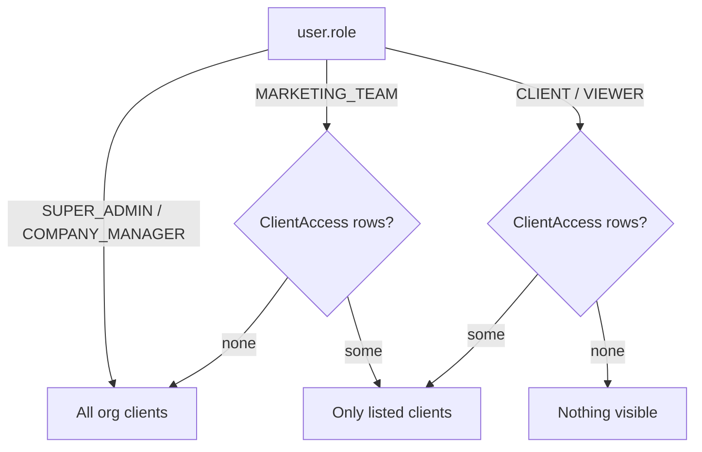

# 02 · Roles & Permissions

> **ملخص بالعربية**
>
> يوجد خمسة أدوار: **مدير النظام (SUPER_ADMIN)**، **مدير الشركة (COMPANY_MANAGER)**، **فريق التسويق (MARKETING_TEAM)**، **العميل (CLIENT)**، **المشاهد (VIEWER)**. لكل دور مجموعة صلاحيات افتراضية بصيغة `المورد:الإجراء` (مثل `content:approve_client`)، ويمكن إضافة أو سحب صلاحية لمستخدم بعينه.
>
> قواعد ثابتة لا يمكن تجاوزها حتى بالتعديل الفردي:
> - إدارة التكاملات ورموز المنصات (`integrations:manage`) وإعدادات النظام (`settings:manage`) لمدير النظام فقط.
> - العميل لا يرى التعليقات الداخلية ولا يعتمد داخليًا ولا يدير المستخدمين ولا يرى سجل التدقيق.
>
> وصول المستخدم إلى العملاء: المدير العام ومدير الشركة يريان كل عملاء المؤسسة؛ فريق التسويق يرى العملاء المخصصين له (أو الكل إن لم يُخصَّص شيء)؛ العميل والمشاهد يريان فقط العملاء المخصصين لهما صراحة.

Source of truth: `src/lib/rbac.ts` (`PERMISSIONS`, `ROLE_PERMISSIONS`, `effectivePermissions`, `ROUTE_PERMISSIONS`) and `src/lib/tenant.ts`. The matrix below was generated by evaluating `effectivePermissions(role, [])` for every role — regenerate it if `rbac.ts` changes (see §7).

## 1. Roles

| Role | Intended user | Default permissions (effective) |
|---|---|---|
| `SUPER_ADMIN` | Agency owner / platform administrator | All 44 |
| `COMPANY_MANAGER` | Account director, head of marketing | 41 — everything except `users:manage`, `integrations:manage`, `settings:manage` |
| `MARKETING_TEAM` | Media buyers, strategists, content creators | 27 |
| `CLIENT` | The client's marketing contact | 15 |
| `VIEWER` | Read-only stakeholder (client executive, auditor) | 12 |

## 2. Permission catalogue

Format `<resource>:<action>`. 44 permissions.

| Group | Permissions | What they unlock |
|---|---|---|
| Dashboard | `dashboard:view` | Executive dashboard, notifications, help |
| Clients | `clients:view` · `clients:create` · `clients:edit` · `clients:delete` | Client list/profile; onboarding wizard; brands, accounts, white-label settings; archive/delete |
| Strategy | `strategy:view` · `strategy:edit` · `strategy:approve` | Strategy builder read / edit sections / approve version |
| Analytics | `analytics:view` · `campaigns:view` | Performance analytics; campaign → ad set → ad drill-down |
| Budget | `budget:view` · `budget:edit` · `budget:approve` · `expenses:edit` | Budget planner & plan-vs-actual; edit plans; approve plans; record manual expenses |
| Content | `content:view` · `content:create` · `content:edit` · `content:delete` · `content:submit` · `content:approve_internal` · `content:approve_client` · `content:comment` · `content:comment_internal` | Calendar, library, approvals; creation; edit; delete; submit for review; internal approval stage; client approval stage; public comments; internal-only comments |
| Intelligence | `competitors:view` · `competitors:edit` · `trends:view` · `trends:edit` · `benchmarks:view` · `benchmarks:edit` | Competitor intelligence, trends & ideas, benchmarks (read / maintain) |
| Reports | `reports:view` · `reports:create` · `reports:share` · `reports:export` | View; build/schedule; create public share links; download CSV/Excel/PDF |
| Tasks | `tasks:view` · `tasks:edit` | Action items |
| Administration | `users:view` · `users:manage` · `integrations:view` · `integrations:manage` · `settings:view` · `settings:manage` · `audit:view` | Users list; invite/edit/deactivate; integration status; connect/disconnect/tokens; settings read; system settings; audit logs |
| AI & team | `ai:use` · `team:performance` | AI assistant/recommendations; team productivity views |

## 3. Role × permission matrix (effective, no overrides)

| Permission | SUPER_ADMIN | COMPANY_MANAGER | MARKETING_TEAM | CLIENT | VIEWER |
|---|---|---|---|---|---|
| `dashboard:view` | Yes | Yes | Yes | Yes | Yes |
| `clients:view` | Yes | Yes | Yes | Yes | Yes |
| `clients:create` | Yes | Yes | — | — | — |
| `clients:edit` | Yes | Yes | — | — | — |
| `clients:delete` | Yes | Yes | — | — | — |
| `strategy:view` | Yes | Yes | Yes | Yes | Yes |
| `strategy:edit` | Yes | Yes | Yes | — | — |
| `strategy:approve` | Yes | Yes | — | — | — |
| `analytics:view` | Yes | Yes | Yes | Yes | Yes |
| `campaigns:view` | Yes | Yes | Yes | Yes | Yes |
| `budget:view` | Yes | Yes | Yes | Yes | Yes |
| `budget:edit` | Yes | Yes | Yes | — | — |
| `budget:approve` | Yes | Yes | — | — | — |
| `expenses:edit` | Yes | Yes | Yes | — | — |
| `content:view` | Yes | Yes | Yes | Yes | Yes |
| `content:create` | Yes | Yes | Yes | — | — |
| `content:edit` | Yes | Yes | Yes | — | — |
| `content:delete` | Yes | Yes | — | — | — |
| `content:submit` | Yes | Yes | Yes | — | — |
| `content:approve_internal` | Yes | Yes | — | — | — |
| `content:approve_client` | Yes | Yes | — | Yes | — |
| `content:comment` | Yes | Yes | Yes | Yes | — |
| `content:comment_internal` | Yes | Yes | Yes | — | — |
| `competitors:view` | Yes | Yes | Yes | Yes | Yes |
| `competitors:edit` | Yes | Yes | Yes | — | — |
| `trends:view` | Yes | Yes | Yes | Yes | Yes |
| `trends:edit` | Yes | Yes | Yes | — | — |
| `benchmarks:view` | Yes | Yes | Yes | Yes | Yes |
| `benchmarks:edit` | Yes | Yes | — | — | — |
| `reports:view` | Yes | Yes | Yes | Yes | Yes |
| `reports:create` | Yes | Yes | Yes | — | — |
| `reports:share` | Yes | Yes | — | — | — |
| `reports:export` | Yes | Yes | Yes | Yes | — |
| `tasks:view` | Yes | Yes | Yes | Yes | Yes |
| `tasks:edit` | Yes | Yes | Yes | — | — |
| `users:view` | Yes | Yes | — | — | — |
| `users:manage` | Yes | — | — | — | — |
| `integrations:view` | Yes | Yes | Yes | — | — |
| `integrations:manage` | Yes | — | — | — | — |
| `settings:view` | Yes | Yes | — | — | — |
| `settings:manage` | Yes | — | — | — | — |
| `audit:view` | Yes | Yes | — | — | — |
| `ai:use` | Yes | Yes | Yes | — | — |
| `team:performance` | Yes | Yes | — | — | — |

Notes

* `COMPANY_MANAGER` is defined as `ALL` minus `integrations:manage`, `settings:manage`, `users:manage`, then `users:view` is re-added (it was never removed, so the list contains it twice — harmless; the effective set has 41 entries).
* `MARKETING_TEAM` can **submit** content but cannot approve at either stage and cannot delete content.
* `CLIENT` can approve at the **client** stage and comment publicly, and export reports; it cannot edit anything.
* `VIEWER` is strictly read-only (no comments, no exports).

## 4. Hard guards (cannot be overridden)

Applied at the end of `effectivePermissions()`, **after** per-user overrides:

| Rule | Code | Effect |
|---|---|---|
| Only `SUPER_ADMIN` manages integrations/secrets and system settings | `if (role !== "SUPER_ADMIN") { delete integrations:manage; delete settings:manage }` | A grant override such as `"integrations:manage"` on a COMPANY_MANAGER is silently dropped. |
| Clients never see internal work or admin data | `if (role === "CLIENT") { delete content:comment_internal, content:approve_internal, users:manage, audit:view }` | Even an explicit grant can't expose internal comments, internal approval, user management or audit logs to a client. |

Related data-level rules: `Comment.internal = true` rows are filtered out for users without `content:comment_internal`; `Client.hiddenSections` hides sections (and blocks their exports) for `CLIENT` users.

## 5. Per-user overrides

Stored on `User.permissions: String[]`:

* `"budget:edit"` — **grant** (only if it is a known permission in `PERMISSIONS`; unknown strings are ignored).
* `"-content:delete"` — **revoke** (removed even if the role grants it).
* Overrides are applied in order, then the hard guards run.
* Managed from **Users & Permissions** (`/users`, requires `users:manage`). Every change writes an `AuditLog` row (`entity: "User"`, diff of the permission list).

### Examples

| User | Role | Overrides | Result |
|---|---|---|---|
| Senior media buyer | `MARKETING_TEAM` | `["budget:approve", "content:approve_internal"]` | Can approve budgets and give internal content approval. |
| Junior designer | `MARKETING_TEAM` | `["-budget:edit", "-expenses:edit", "-ai:use"]` | Content-only teammate; budget becomes read-only; no AI. |
| Client CMO | `CLIENT` | `["reports:share"]` | Can create public report links for their board. |
| Client finance | `VIEWER` | `["reports:export"]` | Read-only but can download reports. |
| Account director | `COMPANY_MANAGER` | `["users:manage"]` | Can invite and manage users (allowed — not a hard-guarded permission). |
| Account director | `COMPANY_MANAGER` | `["integrations:manage"]` | **No effect** — hard guard. |
| Client | `CLIENT` | `["audit:view", "content:comment_internal"]` | **No effect** — hard guard. |

## 6. Client scoping (`src/lib/tenant.ts`)

`accessibleClientIds(user)` returns the non-archived client ids of `user.organizationId` that the user may see:



* `clientWhere(user, requested?)` → `{ clientId: { in: ids } }`, or `{ clientId: requested }` if allowed, or an impossible `{ clientId: { in: [] } }` if not — so a forged `client=` param yields empty results, not an error that leaks existence.
* `assertClientAccess(user, clientId)` throws `AuthError("NOT_FOUND")` (HTTP 404 from route handlers) for ids outside scope.
* Invitations carry `clientIds[]`; accepting creates the `ClientAccess` rows (`acceptInviteAction`).
* Archived clients (`Client.archived = true`) disappear from every role's scope.

## 7. Page → permission map

From `ROUTE_PERMISSIONS` and `src/components/layout/nav.ts`:

| Route | Permission | Route | Permission |
|---|---|---|---|
| `/dashboard` | `dashboard:view` | `/competitors` | `competitors:view` |
| `/clients` | `clients:view` | `/trends` | `trends:view` |
| `/strategy` | `strategy:view` | `/benchmarks` | `benchmarks:view` |
| `/analytics` | `analytics:view` | `/reports` | `reports:view` |
| `/campaigns` | `campaigns:view` | `/tasks` | `tasks:view` |
| `/budget` | `budget:view` | `/notifications` | `dashboard:view` |
| `/plan-vs-actual` | `budget:view` | `/users` | `users:view` |
| `/calendar` | `content:view` | `/settings` | `settings:view` |
| `/library` | `content:view` | `/audit` | `audit:view` |
| `/approvals` | `content:view` | `/help` | `dashboard:view` |

Without the page permission, `requireUser()` redirects to `/dashboard?denied=<permission>`; server actions and route handlers return **403**.

### Regenerating the matrix

```bash
cat > matrix.tmp.ts <<'EOF'
import { PERMISSIONS, ROLES, effectivePermissions } from "./src/lib/rbac";
console.log("| Permission | " + ROLES.join(" | ") + " |");
for (const p of PERMISSIONS) console.log(`| \`${p}\` | ` + ROLES.map(r => effectivePermissions(r).has(p) ? "Yes" : "—").join(" | ") + " |");
EOF
npx tsx matrix.tmp.ts && rm matrix.tmp.ts
```
