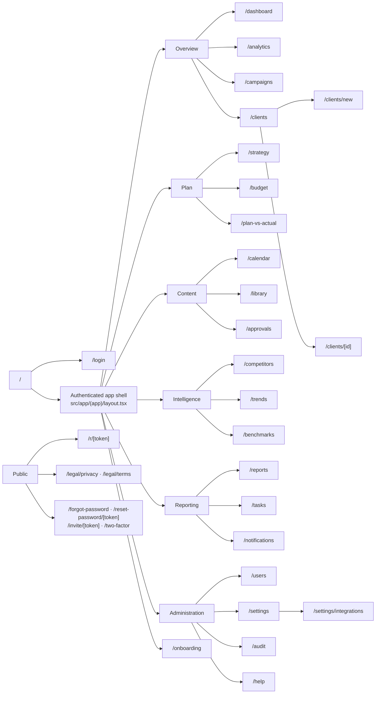

# 03 · Sitemap

> **ملخص بالعربية**
>
> تتكون المنصة من **23 صفحة محمية** بعد تسجيل الدخول، موزعة على ست مجموعات في القائمة الجانبية: نظرة عامة، التخطيط، المحتوى، الذكاء التسويقي، التقارير، الإدارة — بالإضافة إلى صفحة الإعداد الأولي. توجد أيضًا صفحات عامة (تسجيل الدخول، استعادة كلمة المرور، الدعوة، المصادقة الثنائية، التقرير المشارك `/r/…`، الصفحات القانونية) ونقاط API (التصدير، رفع الملفات، ربط المنصات، الـ webhooks، فحص الصحة، الـ cron). كل صفحة مرتبطة بصلاحية محددة، ولا تظهر في القائمة لمن لا يملكها.

Navigation structure is defined once in `src/components/layout/nav.ts` (`NAV`), labels in `src/lib/i18n/messages/common.ts` (`nav.*`), permissions in `src/lib/rbac.ts` (`ROUTE_PERMISSIONS`). The sidebar hides items the user lacks permission for and, for `CLIENT` users, sections listed in `Client.hiddenSections`.

## 1. Map

## 2. Authenticated pages (23)

| # | Route | Nav group | Permission | Purpose |
|---|---|---|---|---|
| 1 | `/dashboard` | Overview | `dashboard:view` | Executive dashboard: KPI cards vs previous period / target / market, spend & results trend, platform split, budget pacing + forecast, top campaigns/ads, AI/rule-based executive summary ("what happened, why, what to do"). Reference implementation. |
| 2 | `/analytics` | Overview | `analytics:view` | Performance analytics across paid + organic: trends, breakdowns (device, placement, gender, age, country), funnel, comparisons, cohort of KPIs. |
| 3 | `/campaigns` | Overview | `campaigns:view` | Campaign → ad set → ad drill-down with KPIs, status, objective, funnel stage, creative previews. |
| 4 | `/clients` | Overview | `clients:view` | Client portfolio: health, spend, account manager, contract, demo flag. |
| 5 | `/clients/[id]` | (from list) | `clients:view` (+ `clients:edit` to change) | Client profile: brands, ad accounts, contacts, products, audiences, branches, white-label settings (`hiddenSections`, colours, report theme), user access. `/clients/new` (requires `clients:create`) is the creation form. |
| 6 | `/strategy` | Plan | `strategy:view` | Strategy builder: sections (overview, personas, funnel, positioning, pillars, channels, KPIs, monthly/quarterly/yearly plan…), versioning, approval (`strategy:approve`), AI suggestions pending review. |
| 7 | `/budget` | Plan | `budget:view` | Budget planner: period, scenario (conservative / balanced / aggressive / custom), allocation by platform / objective / funnel / campaign, expected results from assumptions (CPM, CPC, CPL, CVR), approval. |
| 8 | `/plan-vs-actual` | Plan | `budget:view` | Planned vs actual spend and results per line, variance with good/warning/bad tones, pacing, manual expenses. |
| 9 | `/calendar` | Content | `content:view` | Content calendar (month / week / list), drag-to-reschedule, per-client timezone, recurrence, conflicts, best-time hints (estimate). |
| 10 | `/library` | Content | `content:view` | Content & asset library: search/filter all items and uploaded files (`FileAsset`), versions. |
| 11 | `/approvals` | Content | `content:view` | Approval center: internal review and client review queues, comments (internal vs public), decisions (approve / request changes / reject), deadlines. |
| 12 | `/competitors` | Intelligence | `competitors:view` | Competitor profiles, ads observed in official ad libraries, **Estimated Advertising Intensity**, posts, SWOT, suggested competitors (pending acceptance), competitor-derived ideas. |
| 13 | `/trends` | Intelligence | `trends:view` | Trend signals (Search Console, manual/imported Google Trends, social), idea backlog (source, priority, ease × impact), add-to-calendar. |
| 14 | `/benchmarks` | Intelligence | `benchmarks:view` | Market benchmarks (p25 / median / p75) by metric, platform, country, industry, objective — with source and date; client performance vs benchmark. |
| 15 | `/reports` | Reporting | `reports:view` | Report builder (daily, weekly, monthly client, executive, campaign, content, competitor, budget, annual), schedules, recipients, share links (`reports:share`), PDF/Excel export. |
| 16 | `/tasks` | Reporting | `tasks:view` | Action items (from reports, alerts or manual), assignee, due date, priority, status board. |
| 17 | `/notifications` | Reporting | `dashboard:view` | Alert inbox (spend over/under, CPL up, ROAS down, frequency, token expiring, sync stopped, content due/rejected, competitor ad, trend) and preferences. |
| 18 | `/users` | Administration | `users:view` (`users:manage` to change) | Users, roles, per-user permission overrides, client access, invitations, deactivation, 2FA status. |
| 19 | `/settings` | Administration | `settings:view` (`settings:manage` to change) | Organization profile, branding, default currency/timezone/locale, FX table, security policy, notification defaults. |
| 20 | `/settings/integrations` | Administration | `integrations:view` (`integrations:manage` to connect) | Connectors per platform/client: status, masked token (`****1234`), scopes granted vs required, last sync, errors, "Sync now", "Test", disconnect. |
| 21 | `/audit` | Administration | `audit:view` | Audit log viewer with filters (user, action, entity, client, date) and export. |
| 22 | `/help` | Administration | `dashboard:view` | Help & documentation (bilingual), glossary of KPIs, data-source explanations. |
| 23 | `/onboarding` | (post-invite) | authenticated | First-run wizard: profile, language, 2FA, (admins) first client + integrations. New invitees land here. |

## 3. Public routes

| Route | Purpose | Notes |
|---|---|---|
| `/` | Landing → redirects to `/dashboard` (signed in) or `/login`. | |
| `/login` | E-mail + password sign-in. | Indexable; rate-limited (20/15 min per IP, 8/15 min per e-mail). |
| `/two-factor` | TOTP code after password when 2FA is enabled. | 6 attempts / 5 min. |
| `/forgot-password` | Request reset link (same response whether or not the e-mail exists). | 5 / 15 min per IP. |
| `/reset-password/[token]` | Set new password; single-use token valid 60 min; revokes all sessions. | |
| `/invite/[token]` | Accept invitation: name + password → user + `ClientAccess` rows → `/onboarding`. | |
| `/r/[token]` | Read-only shared report. Token hashed in `Report.shareTokenHash`, optional `shareExpiresAt`. | `noindex`, no app chrome, white-label theme. |
| `/legal/privacy`, `/legal/terms` | Privacy policy and terms (see `docs/legal/`). | Indexable. |

## 4. API routes

Full contract in [api.md](api.md).

| Route | Method | Auth | Permission | Purpose |
|---|---|---|---|---|
| `/api/export/[dataset]` | GET | Session | Per dataset (e.g. `campaigns:view`, `content:view`, `audit:view`) | CSV / Excel export of the current filtered view. Datasets: `campaigns, adsets, ads, platforms, daily, content, budget, benchmarks, competitors, competitor-ads, ideas, tasks, audit`. |
| `/api/uploads` | POST | Session + same origin | `content:edit` + tenant | Upload an asset (≤ 25 MB; JPEG/PNG/GIF/WebP/HEIC/PDF/MP4/MOV/WebM detected by magic bytes; SVG refused) → `FileAsset`. |
| `/api/uploads/[id]` | GET | Session | `content:view` + tenant | Stream a stored file. |
| `/api/oauth/[platform]/start` | GET | Session | `integrations:manage` | Begin OAuth; sets signed `state` + PKCE verifier. |
| `/api/oauth/[platform]/callback` | GET | `state` cookie | `integrations:manage` | Exchange code → encrypted tokens → `Integration` CONNECTED → queue first sync. |
| `/api/webhooks/[platform]` | POST | Platform signature | — | Receive platform change notifications → queue incremental sync. |
| `/api/health` | GET | none | — | Liveness + DB check for Docker/Caddy/uptime monitors. |
| `/api/cron/[task]` | POST | `Bearer CRON_SECRET` | — | Run due jobs when no worker process exists (shared hosting). |
| `/api/public/*` | — | varies | — | Reserved prefix for future public endpoints (excluded from the session gate in `middleware.ts`). |

## 5. Global UI elements on every authenticated page

* **Sidebar** (`src/components/layout/sidebar.tsx`) — groups above; collapsible; off-canvas on mobile.
* **Filter bar** (`src/components/layout/filter-bar.tsx`) — client, brand, account, platform, date range, compare, and advanced filters; hidden on `/settings`, `/users`, `/audit`, `/help`, `/notifications`, `/onboarding`, `/clients/new` (`NO_FILTER_BAR`).
* **Header** — locale switch (AR/EN), theme, notifications bell, user menu (profile, 2FA, sign out everywhere).
* **Export menu** — CSV / Excel / PDF (print) / PNG.
