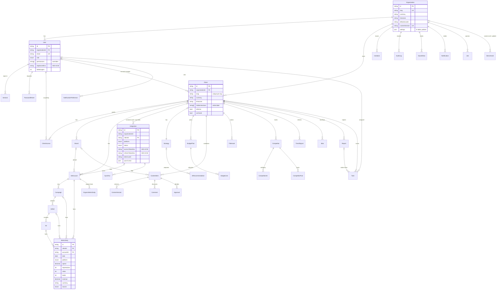

# 04 · Database Schema

> **ملخص بالعربية**
>
> قاعدة البيانات PostgreSQL تُدار عبر Prisma (`prisma/schema.prisma`) وتضم 39 جدولًا. الهيكل: المؤسسة ← العميل ← العلامة التجارية ← الحساب الإعلاني. كل جدول يخص عميلًا يحمل الحقل `clientId` (أو يرتبط بجدول أب يحمله) لضمان عزل بيانات العملاء. رموز المنصات وأسرار المصادقة الثنائية مشفرة (الحقول المنتهية بـ `Enc`)، وروابط المشاركة والجلسات وإعادة التعيين تُخزَّن كبصمة `sha256` فقط وليس كنص. كل صف بيانات يحمل مصدره (API/يدوي/استيراد/تقدير/تجريبي). الترحيلات في `prisma/migrations` وتُطبّق في الإنتاج بالأمر `prisma migrate deploy`.

* Engine: PostgreSQL 16 (14+ supported). ORM: Prisma 6. IDs: `cuid()` strings. Money: `Decimal(14,2)` with an explicit `currency` column. Dates of daily facts: `@db.Date` (UTC day).
* Migrations: `prisma/migrations/` (initial: `20260930111808_init`). Dev: `npm run db:migrate:dev`. Prod: `npm run db:migrate` (`prisma migrate deploy`).
* Deletion semantics: children of `Organization` and `Client` are `onDelete: Cascade`; optional references to users/brands/integrations are `SetNull`.

## 1. ERD

## 2. Enums

| Enum | Values |
|---|---|
| `Role` | SUPER_ADMIN, COMPANY_MANAGER, MARKETING_TEAM, CLIENT, VIEWER |
| `Platform` | META, FACEBOOK, INSTAGRAM, GOOGLE_ADS, TIKTOK, LINKEDIN, YOUTUBE, X, GA4, SEARCH_CONSOLE, GOOGLE_TRENDS, EMAIL, CALENDAR, CLOUD_STORAGE |
| `DataSource` | API, MANUAL, IMPORT, ESTIMATE, DEMO |
| `IntegrationStatus` | CONNECTED, DISCONNECTED, EXPIRED, PERMISSION_MISSING, SYNCING, SYNC_FAILED |
| `CampaignStatus` | ACTIVE, PAUSED, COMPLETED, DRAFT, ARCHIVED |
| `FunnelStage` | AWARENESS, CONSIDERATION, CONVERSION, RETENTION, ADVOCACY |
| `Objective` | AWARENESS, REACH, TRAFFIC, ENGAGEMENT, VIDEO_VIEWS, LEADS, SALES, APP_INSTALLS, MESSAGES |
| `ContentStatus` | IDEA, BRIEF, IN_PRODUCTION, INTERNAL_REVIEW, CLIENT_REVIEW, APPROVED, SCHEDULED, PUBLISHED, NEEDS_REVISION, REJECTED |
| `ContentType` | IMAGE, VIDEO, REEL, STORY, CAROUSEL, TEXT, ARTICLE, LIVE, SHORT, LEAD_FORM |
| `Priority` | LOW, MEDIUM, HIGH, CRITICAL |
| `CompetitorOrigin` | MANUAL, SUGGESTED |
| `SuggestionState` | PENDING, ACCEPTED, REJECTED |
| `IdeaSource` | COMPETITOR, TREND, ORIGINAL |
| `AlertSeverity` | SUCCESS, INFO, WARNING, CRITICAL |
| `TaskStatus` | TODO, IN_PROGRESS, BLOCKED, DONE |
| `BudgetPeriod` | MONTHLY, QUARTERLY, YEARLY |
| `BudgetScenario` | CONSERVATIVE, BALANCED, AGGRESSIVE, CUSTOM |
| `BudgetLineCategory` | PLATFORM, OBJECTIVE, FUNNEL, PROSPECTING, RETARGETING, RETENTION, CAMPAIGN, AUDIENCE, PRODUCTION, TESTING, SCALING, CONTINGENCY |
| `ReportType` | DAILY, WEEKLY, MONTHLY_CLIENT, EXECUTIVE, CAMPAIGN, CONTENT, COMPETITOR, BUDGET, ANNUAL |
| `ApprovalDecision` | APPROVED, REJECTED, CHANGES_REQUESTED |
| `JobStatus` | QUEUED, RUNNING, SUCCEEDED, FAILED |

## 3. Tables

Legend — **Isolation**: how a row is tied to a tenant. **Sensitive**: encrypted / hashed / PII fields.

### Tenancy

| Table | Purpose | Key columns | Isolation | Indexes / uniques |
|---|---|---|---|---|
| `Organization` | Agency / company (tenant root). | `slug`, `currency` (default EGP), `timezone` (Africa/Cairo), `defaultLocale` (ar), `primaryColor`, `customDomain`, `settings` JSON (FX table `settings.fx`, policies) | self | `slug` UK, `customDomain` UK |
| `Client` | Business being marketed. | profile (industry, country, website, products[], audiences[], branches[]), contact, `accountManagerId`, contract/package, `isB2B`, white label (`hiddenSections[]`, `brandColors[]`, `fonts[]`, `reportTheme`), `isDemo`, `archived` | `organizationId` | `(organizationId, slug)` UK, `organizationId` |
| `Brand` | Sub-brand of a client. | `name`, `logoUrl`, `colors[]` | `clientId` | `clientId` |
| `AdAccount` | Ad account / page / property on a platform. | `platform`, `externalId`, `currency`, `timezone`, `isOrganic`, `source`, `integrationId`, `brandId` | `clientId` | `(platform, externalId, clientId)` UK, `clientId` |

### Users & access

| Table | Purpose | Key columns | Isolation | Sensitive | Indexes |
|---|---|---|---|---|---|
| `User` | Person with a role. | `role`, `permissions[]` overrides, `locale`, `active`, `failedLogins`, `lockedUntil`, `lastLoginAt` | `organizationId` | `passwordHash` (bcrypt 12), `totpSecretEnc` (AES-GCM), `email` (PII) | `email` UK, `organizationId` |
| `ClientAccess` | Explicit user ↔ client grant. | `userId`, `clientId` | both | — | `(userId, clientId)` UK |
| `Session` | Login session. | `userAgent`, `ip`, `twoFactorOk`, `lastSeenAt`, `expiresAt` | via user | `tokenHash` = sha256(cookie) | `tokenHash` UK, `userId` |
| `PasswordReset` | One-time reset link (60 min). | `expiresAt`, `usedAt` | via user | `tokenHash` | `tokenHash` UK |
| `Invitation` | Pending invite. | `email`, `role`, `clientIds[]`, `invitedById`, `expiresAt`, `acceptedAt` | `organizationId` | `tokenHash` | `tokenHash` UK, `organizationId` |
| `AuditLog` | Immutable trail of actions. | `userId`, `userEmail`, `clientId`, `action`, `entity`, `entityId`, `summary`, `diff` (sanitized), `ip` | `organizationId` (+ `clientId`) | `ip` (PII) | `(organizationId, createdAt)`, `(entity, entityId)` |
| `SavedView` | Named filter set (URL query). | `path`, `query`, `shared` | `organizationId` + `userId` | — | `organizationId` |

### Integrations & jobs

| Table | Purpose | Key columns | Isolation | Sensitive | Indexes |
|---|---|---|---|---|---|
| `Integration` | Connection to a platform for a client (or org-wide when `clientId` null). | `platform`, `label`, `status`, `scopesGranted[]`, `scopesRequired[]`, `externalAccountId`, `tokenExpiresAt`, `lastSyncAt`, `lastSuccessAt`, `lastError`, `syncCursor` JSON, `enabled` | `organizationId` + `clientId` | `accessTokenEnc`, `refreshTokenEnc` (AES-GCM); only `tokenLast4` leaves the server | `organizationId`, `clientId` |
| `SyncRun` | One sync/test/connect/refresh attempt. | `kind`, `status`, `startedAt`, `finishedAt`, `rowsUpserted`, `message` | via integration | — | `(integrationId, startedAt)` |
| `Job` | Postgres job queue. | `type`, `payload`, `status`, `attempts`, `maxAttempts` (5), `runAt`, `lockedAt`, `lastError` | `organizationId` (nullable for system jobs) | payload must not contain secrets | `(status, runAt)` |

### Paid & organic media

| Table | Purpose | Key columns | Isolation | Indexes |
|---|---|---|---|---|
| `Campaign` | Platform campaign. | `externalId`, `platform`, `objective`, `status`, `funnelStage`, `product`, `country`, `branch`, `dailyBudget`, dates, `source` | `clientId` | `clientId`, `accountId` |
| `AdSet` | Ad set / ad group. | `externalId`, `audience`, `status` | via campaign | — |
| `Ad` | Ad / creative. | `format`, `headline`, `previewUrl`, `status` | via ad set | — |
| `MetricDaily` | Daily fact table (one row per date × level × breakdown). | `date`, `platform`, breakdowns (`device`, `placement`, `gender`, `ageRange`, `country`), measures (`spend`, `impressions`, `reach`, `clicks`, `leads`, `purchases`, `revenue`, `videoViews`, `videoCompletions`, `engagements`), `currency`, `source`, `syncedAt` | `clientId` | `(clientId, date)`, `(campaignId, date)`, `(accountId, date)` |
| `OrganicMetricDaily` | Daily page/profile stats. | `followers`, `posts`, `reach`, `impressions`, `engagements`, `videoViews`, `source` | `clientId` | `(accountId, date)` UK, `(clientId, date)` |

### Strategy & budget

| Table | Purpose | Key columns | Isolation | Indexes |
|---|---|---|---|---|
| `Strategy` | One living strategy per client. | `sections` JSON (overview, personas, funnel, pillars, channels, KPIs, plans…), `status` (DRAFT/IN_REVIEW/APPROVED), `approvedById`, `version` | `clientId` (UK) | `clientId` UK |
| `AiRecommendation` | AI proposal awaiting a human. | `area`, `title`, `body` JSON, `reasoning`, `confidence` 0–1, `dataSources[]`, `state`, `decidedById`, `decidedAt` | `clientId` | `(clientId, state)` |
| `BudgetPlan` | Budget for a period + scenario. | `period`, `scenario`, dates, `totalBudget`, `currency`, `objective`, `assumptions` JSON, `status`, approval, `plannedContent`, `source` | `clientId` | `clientId` |
| `BudgetLine` | Allocation line. | `category`, `label`, `platform`, `campaignId` (for plan vs actual), `funnelStage`, `plannedBudget`, planned impressions/reach/clicks/leads/sales/revenue | via plan | `planId` |
| `Expense` | Manual spend (production, influencer, offline). | `planLineId`, `date`, `amount`, `currency`, `description`, `createdById` | `clientId` (no FK relation — always filter by `clientId`) | `(clientId, date)` |

### Content

| Table | Purpose | Key columns | Isolation | Indexes |
|---|---|---|---|---|
| `ContentItem` | Calendar item / post. | `platform`, `title`, `publishAt` + `timezone`, `type`, `pillar`, `funnelStage`, `objective`, copy (`caption`, `hook`, `cta`, `hashtags[]`, `keywords[]`), assets (`designUrl`, `videoUrl`, `assetUrls[]`), `assigneeId`, `status`, `isPaid`, `boostBudget`, `approvalDeadline`, `recurrence`, `seriesId`, `ideaId`, `version`, result fields, `source` | `clientId` | `(clientId, publishAt)`, `(clientId, status)` |
| `ContentVersion` | Snapshot per edit. | `version`, `snapshot` JSON, `editedById` | via content | `contentId` |
| `Comment` | Discussion. | `body`, `internal` (hidden from CLIENT) | via content | `contentId` |
| `Approval` | Decision at a stage. | `stage` INTERNAL/CLIENT, `decision`, `comment` | via content | `contentId` |
| `FileAsset` | Uploaded file metadata (bytes in `UPLOAD_DIR`). | `name`, `url`, `mimeType`, `sizeBytes`, `uploadedById`, `tags[]` | `clientId` | `clientId` |

### Intelligence

| Table | Purpose | Key columns | Isolation | Indexes |
|---|---|---|---|---|
| `Competitor` | Tracked competitor. | links, `activePlatforms[]`, `origin`, `state` (suggested competitors stay PENDING until accepted), qualitative analysis arrays, `followers` JSON with `asOf` + `source`, `source` | `clientId` | `clientId` |
| `CompetitorAd` | Ad seen in an official ad library. | `libraryId`, `libraryUrl`, `firstSeen`, `lastSeen`, `isActive`, `placements[]`, creative analysis, `variantCount`, `relaunched`, `officialSpendMin/Max` (only if disclosed), `source` | via competitor | `(competitorId, firstSeen)` |
| `CompetitorPost` | Notable organic post. | `postedAt`, `type`, `topic`, `occasion`, `engagements`, `isTopPost`, `source` | via competitor | `(competitorId, postedAt)` |
| `TrendSignal` | Search/social trend. | `keyword`, `kind`, `sourceName`, `sourceUrl`, `growthPct`, `volumeIndex`, `expiresAt`, `source` | `clientId` | `(clientId, discoveredAt)` |
| `Idea` | Content/campaign idea backlog. | `source` (COMPETITOR/TREND/ORIGINAL), provenance fields, platform/format/audience/objective/funnel, `priority`, `ease`, `impact`, `aiGenerated`, `addedToCalendar`, `dataSource` | `clientId` | `(clientId, source)` |
| `Benchmark` | Market reference values. | `metric`, filters (platform, country, industry, size, productType, isB2B, objective, audienceType), `p25`, `median`, `p75`, `higherIsBetter`, `sourceName`, `sourceUrl`, `sampleSize`, `asOf`, `isManual`, `isEstimate` | `organizationId` (null = global) | `(metric, platform)` |

### Reporting & notifications

| Table | Purpose | Key columns | Isolation | Sensitive | Indexes |
|---|---|---|---|---|---|
| `Report` | Report definition / instance. | `type`, `title`, period, `config` JSON, `summary` JSON, `schedule`, `recipients[]`, `lastSentAt` | `clientId` | `shareTokenHash` (sha256 of share token), `shareExpiresAt` | `shareTokenHash` UK, `clientId` |
| `Task` | Action item. | `reportId`, `assigneeId`, `dueDate`, `status`, `priority` | `clientId` | — | `(clientId, status)` |
| `Notification` | In-app alert. | `userId`, `clientId`, `type`, `severity`, `title`, `body`, `link`, `readAt`, `dedupeKey` | `organizationId` | — | `(userId, dedupeKey)` UK, `(organizationId, createdAt)` |
| `NotificationPreference` | Per-user alert settings. | `type`, `clientId`, `platform`, `inApp`, `email`, `threshold` | via user | — | `(userId, type, clientId)` UK |

## 4. Isolation fields — rules of use

1. Client-owned models with a `clientId` column: `Brand, AdAccount, Campaign, MetricDaily, OrganicMetricDaily, Strategy, AiRecommendation, BudgetPlan, Expense, ContentItem, FileAsset, Competitor, TrendSignal, Idea, Report, Task` (+ nullable on `Integration`, `AuditLog`, `Notification`). Always `where: { ...ctx.scope, … }`.
2. Child models without `clientId` are filtered through the parent relation: `AdSet`/`Ad` (`{ campaign: scope }` / `{ adSet: { campaign: scope } }`), `BudgetLine` (`{ plan: scope }`), `ContentVersion`/`Comment`/`Approval` (`{ content: scope }`), `CompetitorAd`/`CompetitorPost` (`{ competitor: scope }`), `SyncRun` (`{ integration: { organizationId } }`).
3. Org-level models filter by `organizationId: user.organizationId`.
4. The schema header comment mentions carrying both `organizationId` and `clientId` on client-owned rows; in the current schema only `Client`, `Integration`, `AuditLog`, `Notification`, `Job`, `SavedView`, `Benchmark` hold `organizationId`. Organization isolation for other rows follows from `Client.organizationId` because `accessibleClientIds` only returns clients of the user's organization.

## 5. Encrypted & hashed fields

| Field | Protection | Notes |
|---|---|---|
| `Integration.accessTokenEnc`, `Integration.refreshTokenEnc` | AES-256-GCM, `v1:<iv>:<tag>:<ct>` | Key: `ENCRYPTION_KEY`. Decrypted only inside connectors / worker. |
| `User.totpSecretEnc` | AES-256-GCM | Decrypted only in `twoFactorAction`. |
| `Integration.tokenLast4` | Plain last 4 chars | Rendered as `****1234` via `mask()`. |
| `Session.tokenHash`, `PasswordReset.tokenHash`, `Invitation.tokenHash`, `Report.shareTokenHash` | SHA-256 | Raw tokens exist only in the cookie / e-mailed link / share URL. |
| `User.passwordHash` | bcrypt cost 12 | Timing-equalised compare for unknown users. |
| `AuditLog.diff` | `sanitize()` redacts keys matching `token|secret|password|authorization|cookie|api_key|…Enc` | Same redaction is applied to logs. |

## 6. Operational notes

* **Volume:** `MetricDaily` dominates. With breakdown rows, expect ~(accounts × campaigns × days × breakdown combos). Keep breakdown syncs selective; plan monthly partitioning beyond ~50 M rows (see [01 §11](01-product-architecture.md#11-scalability-path)).
* **Upserts:** connectors upsert by natural keys (`AdAccount (platform, externalId, clientId)`, campaigns by `externalId` within an account, organic by `(accountId, date)`), so re-syncing a window is idempotent.
* **Demo data:** `prisma/seed.ts` deletes and re-creates the `demo-agency` organization only; all rows are `isDemo`/`source = DEMO`.
* **Backups:** see [backup-restore.md](backup-restore.md). The encryption key is **not** in the database — back it up separately.
