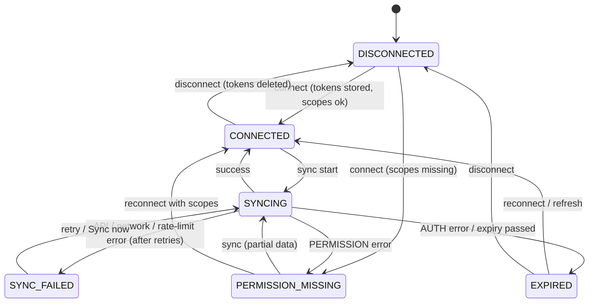

# 05 · Integration Architecture

> **ملخص بالعربية**
>
> تتصل المنصة بمنصات الإعلان والتحليلات عبر **واجهاتها الرسمية فقط** (Meta، Google Ads، GA4، Search Console، YouTube، TikTok، LinkedIn، X). لكل منصة "موصل" (Connector) بواجهة موحدة: التفويض عبر OAuth، اختبار الاتصال، جلب الحسابات، ومزامنة البيانات اليومية وتحويلها إلى جداول موحدة.
>
> - **الرموز (Tokens):** تُشفَّر بـ AES-256-GCM قبل الحفظ، ولا يظهر للمستخدم إلا آخر 4 أحرف (`****1234`). إدارة الربط لمدير النظام فقط.
> - **الحالات:** متصل، غير متصل، منتهي الصلاحية، صلاحيات ناقصة، جارٍ المزامنة، فشل المزامنة.
> - **المزامنة:** تزايدية (آخر يوم مُزامَن مع إعادة سحب آخر 3 أيام)، مع إعادة المحاولة التلقائية واحترام حدود المنصات.
> - **قيود مهمة:** واجهة X تتطلب اشتراكًا مدفوعًا؛ Google Trends لا يملك واجهة رسمية (إدخال يدوي/استيراد فقط)؛ إنفاق المنافسين لا يُعرض إلا إذا أفصحت عنه مكتبة الإعلانات الرسمية، وإلا نعرض **"مؤشر كثافة الإعلان التقديري"**.

Code: `src/lib/integrations/` — `types.ts` (contracts), `providers/*.ts` (connectors), `http.ts` (resilient HTTP), `oauth-state.ts` (state + PKCE), `status.ts` (status machine + sync windows), `mapping.ts` (field mapping), `env.ts` (config readiness). Competitor ads: `src/lib/competitors/meta-ad-library.ts`. UI: `/settings/integrations`. Setup per platform: [integrations-setup.md](integrations-setup.md).

## 1. Principles

1. **Official APIs only.** No scraping, no headless browsers, no unofficial endpoints.
2. **Read-only scopes.** We request the minimum reporting scopes; the platform never gets write access to campaigns.
3. **Connectors are pure API clients.** They never touch the database; the integration service persists results. The folder is imported by the worker (plain Node via `tsx`), so nothing in it imports `server-only`.
4. **Secrets never leave the server.** Encrypted at rest, masked in UI, redacted in logs and audit diffs, never placed in error messages (errors carry only `METHOD host/path`).
5. **Every synced row says where it came from** (`source = API`, `syncedAt`, `Integration.lastSuccessAt`).

## 2. Connector interface

```ts
// src/lib/integrations/types.ts (abridged)
type Connector = {
  id: string;                 // URL id: /api/oauth/<id>/start|callback  (e.g. "meta", "google-ads")
  platform: Platform;         // Prisma enum
  displayName: string;
  authType: "oauth2" | "token" | "none";
  capabilities: ("ads" | "organic" | "analytics" | "search" | "calendar" | "storage" | "email")[];
  requiredScopes: string[];   // compared with granted scopes → PERMISSION_MISSING
  envVars: string[];          // names only; readiness shown as booleans
  docsUrl: string;
  rateLimit: { policy: string; maxConcurrency: number; minIntervalMs: number };
  limitations?: string[];     // shown on the card
  manualToken?: boolean;      // allow pasting a long-lived token instead of OAuth
  pkce?: boolean;
  placeholder?: boolean;      // stores the connection, never syncs (yet)

  authorizeUrl?(state, redirectUri, pkceChallenge?): string;
  exchangeCode?(code, redirectUri, pkceVerifier?): Promise<TokenSet>;
  refreshToken?(token): Promise<TokenSet | null>;
  testConnection(token): Promise<{ ok: true; scopes?: string[]; identity?: string }>;
  listAccounts?(token): Promise<RemoteAccount[]>;
  syncInsights?(input: SyncInput): Promise<SyncOutput>;   // → NormalizedMetric[] + NormalizedOrganic[]
  mapping: string;            // field mapping doc shown in the Data Sync tab
};
```

Errors are `ConnectorError(code)` with `code ∈ AUTH | PERMISSION | RATE_LIMIT | NOT_CONFIGURED | UNSUPPORTED | NETWORK | API`. `statusForError()` maps them: `AUTH → EXPIRED`, `PERMISSION → PERMISSION_MISSING`, `NOT_CONFIGURED → DISCONNECTED`, others → `SYNC_FAILED`.

Normalized output (per account × campaign × day, account currency): `spend, impressions, reach, clicks, leads, purchases, revenue, videoViews, videoCompletions, engagements`; organic per account × day: `followers (nullable), posts, reach, impressions, engagements, videoViews`.

## 3. OAuth flow

```mermaid
sequenceDiagram
  autonumber
  actor A as Super Admin
  participant UI as /settings/integrations
  participant S as /api/oauth/[id]/start
  participant P as Platform (authorize)
  participant C as /api/oauth/[id]/callback
  participant DB as PostgreSQL
  participant Q as Job queue / worker

  A->>UI: Connect "Meta Ads" for client X
  UI->>S: GET (session cookie)
  S->>S: assertUser("integrations:manage"), assertClientAccess
  S->>S: nonce = random(24B); PKCE pair if required
  S->>DB: upsert Integration (status DISCONNECTED, scopesRequired)
  S-->>A: Set-Cookie oauth_state = HMAC-signed {nonce, org, client, integration, user, connector, verifier, exp 10 min} (HttpOnly)
  S-->>A: 302 → authorizeUrl(state=nonce, redirect_uri=APP_URL/api/oauth/[id]/callback)
  A->>P: consent (read-only scopes)
  P-->>A: 302 → callback?code=…&state=nonce
  A->>C: GET callback (cookie + code + state)
  C->>C: verifyState(cookie, state): signature, expiry, nonce match, same user/org
  C->>P: exchangeCode(code, redirect_uri, verifier)
  P-->>C: access_token (+ refresh_token, expires_in, scopes)
  C->>C: testConnection → identity + granted scopes
  C->>DB: Integration { accessTokenEnc=encrypt(), refreshTokenEnc, tokenLast4, tokenExpiresAt, scopesGranted, status=deriveStatus() }
  C->>DB: AuditLog { action: "connect", entity: "Integration" } (no secrets)
  C->>Q: enqueue sync.integration (initial backfill)
  C-->>A: 302 /settings/integrations?connected=meta
```

* Redirect URI **must** be registered exactly as `${APP_URL}/api/oauth/<connector id>/callback` (e.g. `https://dashboard.example.com/api/oauth/google-ads/callback`).
* The `state` key is `sha256("oauth-state:v1:" + ENCRYPTION_KEY)` — domain-separated from the encryption key use.
* Connectors marked `manualToken` (Meta, TikTok) also accept a pasted long-lived/system-user token; the same encryption and test apply.

## 4. Token storage, encryption and masking

| Aspect | Implementation |
|---|---|
| Algorithm | AES-256-GCM, 96-bit random IV per encryption, auth tag verified on decrypt (`src/lib/crypto.ts`). Format `v1:<iv>:<tag>:<ciphertext>` (base64). |
| Key | `ENCRYPTION_KEY` (32 bytes base64). Not stored in DB; kept in the server env / secret store. |
| Columns | `Integration.accessTokenEnc`, `refreshTokenEnc`; `User.totpSecretEnc`. |
| Browser | Only `tokenLast4`, rendered by `mask()` as `****1234`; plus status, scopes, expiry, last sync. |
| Access | Only `SUPER_ADMIN` holds `integrations:manage` (hard guard). `MARKETING_TEAM` and `COMPANY_MANAGER` get `integrations:view` (status only). |
| Logs | `logger` passes metadata through `sanitize()` (redacts `token`, `secret`, `password`, `authorization`, `cookie`, `api_key`, `*Enc`). HTTP errors include only `METHOD host/path`. |
| Disconnect | Deletes both encrypted tokens, sets `DISCONNECTED`, audits `disconnect`. Revocation at the platform is recommended in the guide. |
| Key rotation | The `v1:` prefix allows a versioned key ring: add the new key as v2, re-encrypt all rows with a one-off script, remove v1. See [security.md §Key rotation](security.md#10-token-encryption--key-rotation). |

## 5. Status machine



* `deriveStatus()` recomputes from facts at rest: no credentials → `DISCONNECTED`; expiry passed → `EXPIRED`; `missingScopes(required, granted)` non-empty → `PERMISSION_MISSING`.
* `canSync()` allows `CONNECTED`, `SYNC_FAILED`, `PERMISSION_MISSING` (and `enabled = true`).
* `expiryState()` warns 14 days ahead (`EXPIRY_WARNING_DAYS`) → `TOKEN_EXPIRING` notification.
* UI tones (`STATUS_TONE`): CONNECTED good · SYNCING info · PERMISSION_MISSING warning · EXPIRED / SYNC_FAILED bad · DISCONNECTED neutral.

## 6. Sync pipeline

```mermaid
flowchart LR
  T["Trigger<br/>schedule · Sync now · webhook · first connect"] --> J["Job sync.integration<br/>(Job table)"]
  J --> W["Worker picks job<br/>(SKIP LOCKED)"]
  W --> R{"token near expiry?"}
  R -->|yes| RF["refreshToken() → re-encrypt"]
  R -->|no| WIN
  RF --> WIN["syncWindow() per account<br/>first: 90 days · then: last until − 3 days → today"]
  WIN --> CH["chunkWindow()<br/>(e.g. TikTok ≤ 30 days)"]
  CH --> API["connector.syncInsights()<br/>requestJson: timeout, retries, backoff, Retry-After"]
  API --> N["Normalized rows"]
  N --> UP["Upsert MetricDaily / OrganicMetricDaily / Campaign<br/>source=API, syncedAt=now"]
  UP --> CUR["Integration.syncCursor.accounts[id].until = until<br/>lastSyncAt / lastSuccessAt"]
  CUR --> SR["SyncRun { status, rowsUpserted, message }"]
  API -- ConnectorError --> ERR["statusForError() → Integration.status, lastError<br/>Notification SYNC_STOPPED / PERMISSION_MISSING"]
```



### Incremental windows

`syncWindow(lastUntil)` in `status.ts`:

* First sync backfills `initialDays = 90`.
* Later syncs restart `lookbackDays = 3` before the last synced day, because platforms restate recent days (attribution windows, late conversions; Search Console finalizes after ~2–3 days).
* Window always ends **today** (the partial day is re-pulled next run) and never exceeds `maxDays = 400`.
* Re-pulling is idempotent thanks to upserts keyed on natural ids.

### Retries and rate limits

`requestJson()` in `http.ts`:

* Per-attempt timeout (AbortController); default 4 retries.
* Exponential backoff with jitter: `min(maxDelay, base·2^attempt) × (0.5…1)` (base 500 ms, cap 30 s).
* Honours `Retry-After` (seconds or HTTP date) on 429/503.
* Provider `classify()` hooks detect throttling hidden in 200/400 bodies (Meta codes 4/17/32/613/80000+, TikTok 40100-series).
* Per-connector `rateLimit.maxConcurrency` and `minIntervalMs` between paginated calls.
* Job-level retry: a failed job is retried with backoff up to `Job.maxAttempts = 5`, then marked `FAILED` and surfaced in the Data Sync tab.

### Webhooks

`POST /api/webhooks/[platform]` (public prefix in `middleware.ts`) accepts change notifications where platforms offer them (e.g. Meta Page/Instagram webhooks — `GET` verification with `META_WEBHOOK_VERIFY_TOKEN`, payload signature `X-Hub-Signature-256` = HMAC-SHA256 with `META_APP_SECRET`). Handlers verify the signature, never trust the payload for data, and only enqueue an incremental `sync.integration` job for the affected account. Polling remains the source of truth.

### Currency and time zones

Rows are stored in the **account currency** with a `currency` column; roll-ups convert with the organization FX table (`src/lib/fx.ts`) and show an FX note. Dates are the platform-reported account-timezone day.

## 7. Per-platform matrix

| Platform (connector id) | Official API | Scopes / permissions (read-only) | Env vars | What is synced | Limitations |
|---|---|---|---|---|---|
| Meta Ads (`meta`) | Marketing API — Insights (Graph API, `META_GRAPH_VERSION`, default v23.0) | `ads_read`, `business_management` | `META_APP_ID`, `META_APP_SECRET` | Ad accounts; campaign × day: spend, impressions, reach, clicks, actions → leads/purchases, action_values → revenue, video p100 | App Review + Business Verification for Advanced Access; rate limits per ad account (Business Use Case). Reach at campaign × day is not additive across days. |
| Facebook Pages (`facebook`) | Graph API — Page Insights | `pages_show_list`, `pages_read_engagement`, `read_insights` | same | Pages; followers, posts, reach, impressions, engagements, video views per day | Some metrics deprecated/renamed by Meta over time; history limited. |
| Instagram (`instagram`) | Instagram Platform (Graph) — Insights | `instagram_basic`, `instagram_manage_insights`, `pages_show_list`, `pages_read_engagement` | same | Professional accounts; followers, reach, impressions, engagements, posts | Requires Instagram Professional account linked to a Facebook Page; follower history not available retroactively. |
| Meta Ad Library (competitors) | Ad Library API (`ads_archive`) | Identity-verified developer; user token | `META_AD_LIBRARY_TOKEN` | Competitor ads: dates active, creatives text, platforms, languages; spend/impressions **ranges only when Meta discloses them** (political/issue, some EU ads) | No spend for regular commercial ads outside the EU → **Estimated Advertising Intensity** index. `ad_snapshot_url` embeds a token, so it is never stored. |
| Google Ads (`google-ads`) | Google Ads API (`GOOGLE_ADS_API_VERSION`) | `https://www.googleapis.com/auth/adwords` | `GOOGLE_CLIENT_ID`, `GOOGLE_CLIENT_SECRET`, `GOOGLE_ADS_DEVELOPER_TOKEN`, optional `GOOGLE_ADS_LOGIN_CUSTOMER_ID` | Customers; campaign × day metrics (cost, impressions, clicks, conversions, conversion value, video views) | Developer token needs **Basic access** for production accounts (Test access only works with test accounts); 15k operations/day at Basic. |
| GA4 (`ga4`) | Google Analytics Data API v1 | `analytics.readonly` | Google client vars | Properties; sessions, users, conversions, revenue per day/channel | Token-based property quotas; thresholding/sampling may hide small numbers. |
| Search Console (`search-console`) | Search Analytics API | `webmasters.readonly` | Google client vars | Sites; queries → clicks, impressions, CTR, position → feeds **Trends** | Data final after ~2–3 days (re-synced); 16-month history. |
| YouTube (`youtube`) | YouTube Data API v3 + YouTube Analytics API | `youtube.readonly`, `yt-analytics.readonly` | Google client vars | Channels; views, watch time, subscribers, engagements per day | Data API 10,000 quota units/day per project. |
| Google Calendar (`google-calendar`) | Calendar API | `calendar.readonly` | Google client vars | Placeholder — stores connection for future publishing-date sync | No data synced yet. |
| Google Drive (`google-drive`) | Drive API | `drive.file` | Google client vars | Placeholder — future asset import | Only files created/opened by the app are accessible. |
| TikTok Ads (`tiktok`) | TikTok API for Business — Reporting | Chosen when the app is created (Ads Management read, Reporting); returned as ids in the token response | `TIKTOK_APP_ID`, `TIKTOK_APP_SECRET` | Advertisers; campaign × day spend, impressions, reach, clicks, conversions, payments, video plays/p100, engagements | Max 30 days per reporting request (chunked); per-app QPS/QPM limits; long-lived token without refresh (reconnect if revoked). |
| LinkedIn Ads (`linkedin`) — planned | Marketing API (`LinkedIn-Version: LINKEDIN_API_VERSION`) | `r_ads`, `r_ads_reporting`, `r_organization_social` (organic, optional) | `LINKEDIN_CLIENT_ID`, `LINKEDIN_CLIENT_SECRET` | Ad accounts; campaign × day cost, impressions, clicks, leads (Lead Gen forms), conversions | Access requires approval for the **Advertising API** product; tokens 60 days, refresh 1 year (for approved apps). |
| X Ads / X API (`x`) — planned | X API v2 (+ X Ads API) | `tweet.read`, `users.read`, `offline.access` (OAuth 2.0 PKCE) | `X_CLIENT_ID`, `X_CLIENT_SECRET` | Profile followers and post metrics; ads metrics only with X Ads API access | **Paid tier required** for meaningful read volume (Free tier is write-mostly); Ads API needs separate application. Shown as "requires paid API tier". |
| Google Trends | **No official public API** | — | — | Manual entry or CSV import of Trends exports into `TrendSignal` (`sourceName: "Google Trends"`, `source: MANUAL/IMPORT`) | No automated pulls, by policy (no scraping). |
| E-mail (`EMAIL`) | SMTP | — | `SMTP_*`, `MAIL_FROM` | Outbound only (reports, alerts, invitations) | — |

## 8. Competitor data policy

* Competitor **ads** come only from official ad libraries (currently the Meta Ad Library API) or manual entry by the team — `CompetitorAd.source` records which.
* **Spend** is displayed only as an official range (`officialSpendMin/Max`) when disclosed by the library. Everywhere else the UI shows **Estimated Advertising Intensity** (0–100, LOW / MEDIUM / HIGH) from `src/lib/competitors/intensity.ts`, always labelled as an estimate and with its formula in a tooltip:
  `25·min(active/10,1) + 20·min(avgRunningDays/60,1) + 20·min(variants/30,1) + 15·relaunchShare + 20·min(newAds₁₄d/5,1)`.
* Follower counts and posting frequency for competitors are manual or from public profile numbers entered with `asOf` and `source`.
* AI may adapt competitor ideas but must not copy content verbatim (`GUARDRAILS`).

## 9. Adding a new connector

1. Create `src/lib/integrations/providers/<name>.ts` exporting a `Connector` (no `server-only`).
2. Declare `requiredScopes`, `envVars`, `docsUrl`, `rateLimit`, `limitations`, `mapping`.
3. Implement `authorizeUrl`/`exchangeCode`/`refreshToken` (or `manualToken`), `testConnection`, `listAccounts`, `syncInsights` returning normalized rows; use `requestJson` with a `classify` hook.
4. Register it in the provider registry; add env vars to `.env.example` and [integrations-setup.md](integrations-setup.md).
5. Unit-test mapping and error classification with recorded fixtures (no live calls in CI).
